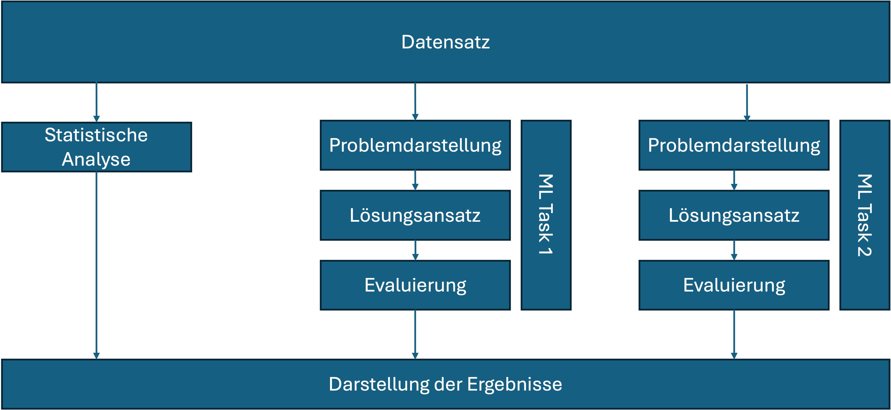

# Zum Projekt

Bitte schauen Sie sich im Foliensatz "NLP00 Organization" zuerst nochmal die Folien Gestaltung des Projekts an.
Die Projekt-Ideen sollen bis zum **29.4.** in Form eines "Project Sheet" in Markdown ins Git eingecheckt sein. Dafür wird bis dahin für jedes Projektteam ein eigenes Git-Repository angelegt.

Verwenden Sie bitte diese Datei hier als Vorlage für das Project-Sheet. Alle Erläuterungen können Sie einfach rauslöschen und nur den Teil ab der Überschrift "Project Sheet" behalten und ergänzen.  
Die Angaben dürfen gern in Stichpunkten erfolgen, es muss nicht in Prosa ausformuliert sein.  

Wer Markdown bisher nicht kennt, bekommt hier gut und schnell einen Überblick: 

* https://www.markdownguide.org/basic-syntax/
* https://guides.github.com/features/mastering-markdown/

Markdown lässt sich auch sehr gut im VS Code editieren. Hier gibt es auch einen Vorschau-Modus, der Ihnen das gerenderte Dokument in einem zweiten Fenster darstellt.

## Was muss das Projekt umfassen?

Am Ende geben Sie ein oder mehrere Notebooks in der geforderten Struktur ab:

1. Szenario und Einführung
2. Datenextraktion und -aufbereitung
3. Datenexploration: verschiedene statistische Analysen und Visualisierungen
4. ML Analyse: Training und Evaluation von ML-Modellen; ggf. ergänzend Nutzung von LLMs
5. Zusammenfassung und Bewertung
6. Literatur und Links zu verwendeten Datensätzen und Blog-Beiträgen

Falls Sie selbst Daten crawlen (Aufwand nicht unterschätzen!), kann nach Absprache mit dem Betreuer der Aufwand für Analysen und ML entsprechend reduziert werden.

## Worum geht's beim Project Sheet?

Es geht darum, dass Sie sich Gedanken machen, was Sie in Ihrem Projekt machen wollen. Ob die Grundidee passend und machbar ist, sollten Sie im Gespräch mit einem von uns Dozenten vorab klären.

Für die Projektidee können Sie entweder schauen, was es für verfügbare Datensätze gibt (siehe unten) oder Sie haben eine ganz eigene Ideen und müssen dann prüfen, ob Sie an passende Daten dafür kommen. Für viele Fragestellungen gibt es auch schon gute Blog-Beträge, die Sie als Inspiration nutzen können.

Web-Quellen für verfügbare NLP-Datensätze (und mehr):
•	https://www.kaggle.com/datasets 
•	https://huggingface.co/datasets
•	https://github.com/niderhoff/nlp-datasets

Klassiker für Datenanalysen sind bspw. die diversen verfügbaren Datensätze mit Amazon Reviews (selber crawlen ist bei Amazon verboten, ebenso wie bei FaceBook und vielen anderen Seiten), IMDB Movie Reviews, News oder Twitter Datensätze.
Leider ist der Zugriff auf Twitter/X sowie Reddit inzwischen nicht mehr so einfach möglich.

Als kleine Inspiration eine unvolständige Liste von Projekten aus den letzten Jahren: 
Computer-Spiele (z.B. Steam Reviews), Bundestagsreden, Kochrezepte, Song-Texte, Stackoverflow, Nachrichten, Stories/Fiction/Bücher, …

Bis hierhin können Sie alles löschen. Jetzt folgt die Vorlage für das Project Sheet.

# Project Sheet: Titel des Projekts

Team-Mitglieder:

* Name+Email 1
* Name+Email 2
* Name+Email 3

## Motivation / Szenario

* Worum geht es in Ihrem Projekt?
* Was ist Ihre Motivation?
* Welches Szenario wollen Sie betrachten?
* Gibt es vielleicht sogar einen hypothetischen Kunden, für den Ihr Anwendungsfall relevant wäre?
* Welche Fragestellungen würden Sie gern beantworten?

## Daten

* Welche Daten wollen Sie für Ihr Projekt verwenden?
* Bitte angeben, ob Sie frei verfügbare Daten verwenden (wenn ja, Link(s) angeben) oder selbst crawlen wollen (dann URL(s) angeben). Falls selber crawlen, vorher checken, ob robots.txt und "Terms of Use" das erlauben.

## Vorgehen

Sofern Sie schon Ideen dazu haben:

* Wie wollen Sie vorgehen?
* Welche statistischen Analysen können Sie sich vorstellen durchführen, um erste interessante Informationen und Zusammenhänge zu finden?
* Was für ML-Modelle wollen Sie trainieren?

## Fragen

Was haben Sie noch für offene Fragen, die Sie mit uns Dozenten klären möchten?
